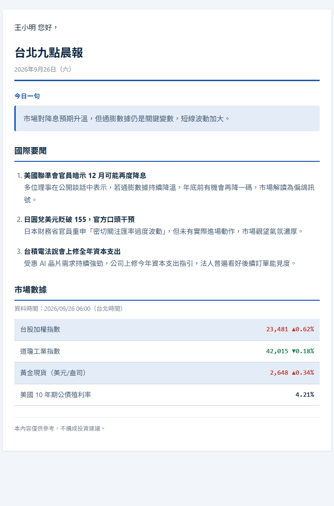

# 範例輸出（Sample Output）

以下是 `python main.py` 實際產生的晨報內容範例（收件人姓名與信箱皆為虛構，僅供展示格式）。

```
王小明 您好，

台北九點晨報 2026年9月26日（六）

── 今日一句 ──
市場對降息預期升溫，但通膨數據仍是關鍵變數，短線波動加大。

── 國際要聞 ──
1. 美國聯準會官員暗示 12 月可能再度降息
多位理事在公開談話中表示，若通膨數據持續降溫，年底前有機會再降一碼，
市場解讀為偏鴿訊號。

2. 日圓兌美元貶破 155，官方口頭干預
日本財務省官員重申「密切關注匯率過度波動」，但未有實際進場動作，
市場觀望氣氛濃厚。

3. 台積電法說會上修全年資本支出
受惠 AI 晶片需求持續強勁，公司上修今年資本支出指引，
法人普遍看好後續訂單能見度。

── 市場數據 ──
資料時間：2026/09/26 06:00（台北時間）
台股加權指數：23,481 ▲0.62%
道瓊工業指數：42,015 ▼0.18%
黃金現貨（美元/盎司）：2,648 ▲0.34%
美國 10 年期公債殖利率：4.21%

本內容僅供參考，不構成投資建議。
```

實際寄出的是 HTML 版本（見下方截圖），套用 `config/theme.yaml` 的顏色與字體設定；
上面這份純文字版本則是給不支援 HTML 的信箱客戶端使用的備援版本，兩者由 `email_renderer.py` 同時產生。

## 📧 HTML 信件截圖


